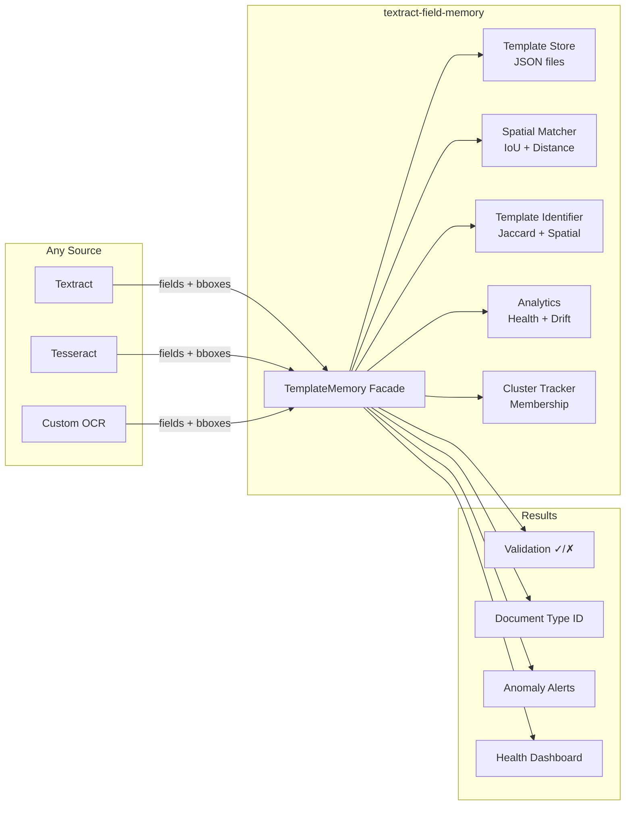

# textract-field-memory

## Disclaimer

This is sample code, for non-production usage. You should work with your security
and legal teams to meet your organizational security, regulatory, and compliance
requirements before deployment.

**Note:** When processing documents containing PII (e.g. SSNs), PHI, or payment data, ensure your implementation meets applicable compliance requirements (HIPAA, PCI-DSS, GDPR, etc.). This library stores only field names and bounding-box coordinates — never field values or document content — but you remain responsible for securing the underlying documents.

---

## The Problem

Every system that processes recurring structured data starts from scratch each time. It has no memory of what it saw yesterday.

```
                    WITHOUT spatial memory
┌──────────────┐
│  Document 1  │──► OCR/Extract ──► "Employee Name" at (0.05, 0.10) ──► ✓ stored nowhere
│  Document 2  │──► OCR/Extract ──► "Employee Name" at (0.05, 0.10) ──► ✓ re-discovered
│  Document 3  │──► OCR/Extract ──► "Employee Name" at (0.05, 0.10) ──► ✓ re-discovered again
│     ...      │
│  Document N  │──► OCR/Extract ──► "Employee Name" at (0.70, 0.85) ──► ✓ looks fine (but WRONG)
└──────────────┘
    No validation. No routing. No anomaly detection. No learning.
```

```
                    WITH spatial memory
┌──────────────┐
│  Document 1  │──► OCR/Extract ──► memory.record() ──► learns positions
│  Document 2  │──► OCR/Extract ──► memory.record() ──► refines positions
│  Document 3  │──► OCR/Extract ──► memory.locate()  ──► "confidence: 0.95 ✓"
│     ...      │
│  Document N  │──► OCR/Extract ──► memory.locate()  ──► "confidence: 0.33 ⚠️ ANOMALY"
└──────────────┘
    Validates. Routes. Detects anomalies. Learns. Monitors drift.
```

**The core idea:** If you've seen 100 identical forms, you KNOW where "Employee Name" should be. If it suddenly appears somewhere else, something is wrong — the form changed, someone tampered with it, or the extraction went sideways.

## Beyond Document Processing

This library works with **any structured data that has spatial/positional attributes** — not just OCR documents:

| Domain | What it remembers | What it detects |
|---|---|---|
| Document OCR (Textract, Tesseract) | Where fields appear on pages | Form changes, extraction errors, tampering |
| UI Testing | Where buttons/inputs render on screen | Layout regressions, responsive breakages |
| Satellite/Geo imagery | Where objects appear in frames | Object displacement, environmental change |
| Manufacturing inspection | Where components sit on boards | Assembly defects, alignment drift |
| Medical imaging | Where anatomical landmarks appear | Scan positioning errors, anomalies |
| Retail planograms | Where products sit on shelves | Misplacement, compliance violations |

The only requirement: your data has **named entities** with **bounding boxes** (x, y, width, height) in normalized coordinates. Feed that in, and the library builds spatial memory over it.

For detailed industry use cases, see [USE_CASES.md](docs/USE_CASES.md).

---

   

**Give your document processing pipeline a memory.**

This library sits after any extraction step and remembers WHERE named entities appear in a spatial layout. It learns patterns from recurring inputs, then uses that knowledge to validate, identify, detect anomalies, monitor drift, and reduce expensive reprocessing.

Zero dependencies. Zero network calls. Pure Python. Works with any input that has named entities + bounding boxes.

## Try It in 30 Seconds

```bash
pip install -e .
python examples/demo.py
```

That's it. No AWS credentials, no config, no external services. You'll see template learning, spatial matching, anomaly detection, and drift analysis — all from synthetic data.

## Should You Use This?

```
Do you process recurring structured documents/layouts?
├── YES → Do they share the same layout (same form, same vendor)?
│         ├── YES → ✅ This library will help (learns positions, validates, detects anomalies)
│         └── NO  → ⚠️ Won't help with extraction, but WILL help you detect/cluster layouts
└── NO  → ❌ Not for you
```

## Architecture



## FAQ

**Q: Does this replace Textract or any OCR engine?**
No. It sits *after* OCR. It needs someone else to extract the fields first — it just remembers where they appeared.

**Q: Do I need AWS credentials to use this?**
No. Zero network calls, zero AWS dependencies. It works locally with JSON files.

**Q: What if my documents are all different layouts?**
It won't help you extract from them, but it will cluster them — telling you "these 12 invoices share a layout, these 8 are different." You can then route known layouts to cheap processing and unknown ones to expensive LLM extraction.

**Q: How many documents does it need to learn a template?**
3-5 documents is enough for basic matching. 10+ gives high-confidence spatial scores.

```python
from field_memory import TemplateMemory

memory = TemplateMemory()
memory.record(document, template_id="invoice-vendor-a")       # learns field positions
matches = memory.locate(new_doc, "Total Amount")              # spatial + name scoring
drift = memory.detect_drift(new_doc, "invoice-vendor-a")      # template change detection
stats = memory.get_stats("invoice-vendor-a")                  # health grade, confidence
result = memory.batch_record(documents)                       # bulk processing
```

## Installation

```bash
pip install textract-field-memory
```

## Quick Start

```python
from field_memory import TemplateMemory

memory = TemplateMemory(store_path="./my_templates")

# 1. Train — feed documents after OCR extraction
memory.record(document, template_id="employment-form")

# 2. Use — spatial lookup, identification, validation
matches = memory.locate(new_doc, "Employee Name")
# → [FieldMatch(combined_score=0.95, spatial_score=0.93, within_expected_region=True)]

match = memory.identify_template(new_doc)
# → TemplateMatch(template_id="employment-form", similarity_score=0.87)

# 3. Monitor — health, drift, stability
stats = memory.get_stats("employment-form")
# → TemplateHealthReport(overall_health_grade="excellent", mean_confidence=0.94)

drift = memory.detect_drift(new_doc, "employment-form")
# → DriftReport(is_drifting=False, overall_drift_score=0.02)

stability = memory.get_field_stability("employment-form")
# → {"Employee Name": 0.97, "SSN": 0.95, "Address": 0.82}

# 4. Operate — batch, export, system dashboard
result = memory.batch_record(documents, template_id="employment-form")
# → BatchResult(success_count=48, failure_count=2, total_count=50)

summary = memory.get_system_summary()
# → SystemSummary(total_templates=5, total_documents=1200, health="excellent")

data = memory.export_template("employment-form", fmt="json")
memory.import_template(data)  # transfer between environments
```

## What It Does

| Capability | Description |
|---|---|
| Template Learning | Records bounding box positions of fields from processed documents |
| Document Routing | Identifies which template a new document matches by field layout |
| Spatial Validation | Scores how well a field's position matches expectations (0.0–1.0) |
| Anomaly Detection | Flags fields that appear in unexpected locations |
| Template Refinement | Improves precision with each document processed (weighted averaging) |
| Template Analytics | Health reports, field stability scores, and system-wide dashboards |
| Drift Detection | Proactively detects when document templates change over time |
| Batch Processing | Process multiple documents in a single call with error isolation |
| Export/Import | Transfer templates between environments in JSON or CSV |
| Confidence Decay | Older observations gradually lose weight so templates stay current |
| In-Memory Caching | Eliminates redundant disk reads for repeated operations |

## When to Use It

**Works great when** documents share the same layout — same form, same vendor invoice, same template. Fields appear in predictable positions, and the library learns and exploits that consistency.

**Doesn't help with extraction when** documents in the same category have completely different layouts (e.g., invoices from 50 different vendors with 50 different designs). There's no single spatial pattern to learn across them.

**But it still helps you answer:** "Are these documents the same layout or different?"

Even with heterogeneous document streams, the library provides value:

| Scenario | How it helps |
|---|---|
| Layout classification | `identify_template()` returns `None` for unknown layouts — instant "is this new?" signal |
| Auto-clustering | `record()` without a `template_id` auto-generates signatures, naturally grouping documents by layout |
| Smart routing | Known layouts → fast spatial extraction. Unknown layouts → expensive LLM or human review |
| Sub-type discovery | Within "invoices" you might have 12 distinct layouts — the library finds them automatically |

```python
match = memory.identify_template(new_document)

if match is not None:
    # Known layout — use spatial memory for fast, cheap extraction
    fields = memory.locate(new_document, "Invoice Total")
    process_with_confidence(fields)
else:
    # Unknown layout — route to LLM or manual review
    template_id = memory.record(new_document)  # learns it for next time
    route_to_expensive_pipeline(new_document)
```

Over time, the library builds a map of all distinct layouts in your pipeline. Documents that initially required expensive processing get recognized on subsequent encounters.

## Why No LLM Inside?

This library deliberately has zero dependencies and makes zero network calls. That's a feature, not a limitation.

**The design philosophy:** This library is the cheap, fast first pass that decides *whether* you need an LLM — not a wrapper around one.

| Concern | With embedded LLM | Without (current design) |
|---|---|---|
| Cost per call | $0.003–0.01 per field | $0 (pure computation) |
| Latency | 500ms–2s (API round-trip) | <1ms (local dict lookup) |
| Dependencies | boto3, API keys, credentials | None |
| Offline/air-gapped | Broken | Works everywhere |
| Lambda cold start | Heavy (SDK + auth) | Instant |
| Failure modes | Rate limits, timeouts, cost spikes | None |

**The right architecture is complementary, not embedded:**

```python
from field_memory import TemplateMemory

memory = TemplateMemory()

def smart_extract(document, field_name):
    """Use spatial memory first, fall back to LLM only when needed."""
    matches = memory.locate(document, field_name)

    if matches and matches[0].within_expected_region and matches[0].combined_score > 0.9:
        # Spatial memory is confident — skip the LLM call entirely
        return matches[0].key_value, "spatial"

    # Low confidence or unknown layout — pay for LLM
    llm_result = call_bedrock(document, field_name)
    return llm_result, "llm"

# With spatial memory handling known templates, a significant portion of
# fields can be resolved without LLM calls — reducing per-batch costs.
```

**If you want LLM integration**, build a thin orchestration layer on top:

```python
# your_pipeline/extractor.py
from field_memory import TemplateMemory
import boto3

class SmartExtractor:
    def __init__(self):
        self.memory = TemplateMemory()
        self.bedrock = boto3.client("bedrock-runtime")

    def extract(self, document, fields):
        results = {}
        for field in fields:
            matches = self.memory.locate(document, field)
            if matches and matches[0].combined_score > 0.9:
                results[field] = matches[0].key_value  # free
            else:
                results[field] = self._llm_extract(document, field)  # paid
        return results
```

This keeps the core library portable, testable, and free — while your application layer decides when to spend money on LLM calls.

## What It Does NOT Do

- Does not call AWS APIs (zero network calls)
- Does not extract text from documents
- Does not replace Textract or LLM extraction
- Has zero external dependencies (pure Python stdlib)

## Using with Real PDFs

The demos use synthetic data so they run without credentials. For real documents, you add an extraction step before calling `memory.record()`. This library doesn't care where the data comes from — it just needs objects with `.pages[].key_values[].key[].text` and `.bbox.x/.y/.width/.height`.

### Option A: AWS Textract + textractor (recommended)

```bash
pip install amazon-textract-textractor boto3
```

```python
from textractor import Textractor
from textractor.data.constants import TextractFeatures
from field_memory import TemplateMemory

# Extract fields from a PDF
extractor = Textractor(region_name="us-east-1")
document = extractor.analyze_document(
    file_source="s3://DOC-EXAMPLE-BUCKET/invoice.pdf",
    features=[TextractFeatures.FORMS],
)

# Feed into field memory
memory = TemplateMemory(store_path="./templates")
memory.record(document, template_id="invoice-vendor-a")

# On subsequent documents
new_doc = extractor.analyze_document(
    file_source="s3://DOC-EXAMPLE-BUCKET/invoice_2.pdf",
    features=[TextractFeatures.FORMS],
)
matches = memory.locate(new_doc, "Total Amount")
stats = memory.get_stats("invoice-vendor-a")
drift = memory.detect_drift(new_doc, "invoice-vendor-a")
```

### Option B: Raw boto3 (no textractor dependency)

```python
import boto3
from dataclasses import dataclass
from typing import List
from field_memory import TemplateMemory

client = boto3.client("textract")
response = client.analyze_document(
    Document={"S3Object": {"Bucket": "DOC-EXAMPLE-BUCKET", "Name": "form.pdf"}},
    FeatureTypes=["FORMS"],
)

# Convert Textract blocks to the shape this library expects
@dataclass
class Word:
    text: str

@dataclass
class BBox:
    x: float
    y: float
    width: float
    height: float

@dataclass
class KeyValue:
    key: List[Word]
    bbox: BBox
    page: int
    confidence: float = 0.95

@dataclass
class Page:
    key_values: List[KeyValue]

@dataclass
class Document:
    pages: List[Page]

# Parse Textract response blocks into these objects
document = parse_textract_response(response)  # you write this parser

memory = TemplateMemory()
memory.record(document, template_id="my-form")
```

### Option C: Local PDF with Tesseract (no AWS needed)

```bash
pip install pytesseract pdf2image
```

```python
import pytesseract
from pdf2image import convert_from_path
from field_memory import TemplateMemory

# Convert PDF pages to images, run OCR
images = convert_from_path("form.pdf")
for img in images:
    data = pytesseract.image_to_data(img, output_type=pytesseract.Output.DICT)
    # Build document object from tesseract bounding boxes...

memory = TemplateMemory()
memory.record(document, template_id="local-form")
```

### Option D: Any OCR output (Google Vision, Azure, custom)

The library works with any object that has the right shape — no coupling to any specific OCR provider:

```python
# Whatever produces field names + bounding boxes works
document = Document(pages=[
    Page(key_values=[
        KeyValue(
            key=[Word("Invoice"), Word("Number")],
            bbox=BBox(x=0.60, y=0.05, width=0.20, height=0.03),
            page=1,
        ),
    ])
])

memory = TemplateMemory()
memory.record(document)
```

## Analytics & Monitoring

The library provides observability features for your document processing pipelines.

### Template Health Reports

```python
stats = memory.get_stats("employment-form")
print(stats.overall_health_grade)  # "excellent", "good", "developing", "insufficient"
print(stats.mean_confidence)       # 0.94
print(stats.field_count)           # 12
print(stats.sample_count)          # 250
```

Health grades are computed from confidence scores and sample maturity:
- **excellent**: mean confidence > 0.9 and 10+ samples
- **good**: mean confidence > 0.7 and 5+ samples
- **developing**: 2–5 samples (still learning)
- **insufficient**: 1 sample or low confidence

### Field Stability Scoring

```python
stability = memory.get_field_stability("employment-form")
# → {"Employee Name": 0.97, "SSN": 0.95, "Address": 0.82, "Notes": 0.45}

# Fields with low stability are unreliable — they move between documents
for field, score in stability.items():
    if score < 0.7:
        print(f"⚠️ {field} is unstable (score={score:.2f})")
```

### Template Drift Detection

Detect when a form template is changing over time — fields gradually moving, new fields appearing, or old fields disappearing:

```python
drift = memory.detect_drift(new_document, "employment-form")

if drift.is_drifting:
    print(f"⚠️ Template drift detected! Score: {drift.overall_drift_score:.3f}")
    print(f"   Drifting fields: {drift.drifting_fields}")
    print(f"   New fields: {drift.new_fields}")
    print(f"   Missing fields: {drift.missing_fields}")
```

### System-Wide Dashboard

```python
summary = memory.get_system_summary()
print(f"Templates: {summary.total_template_count}")
print(f"Documents processed: {summary.total_documents_processed}")
print(f"Overall health: {summary.mean_template_health_grade}")
print(f"Most active: {summary.most_active_template}")

# Breakdown by health grade
for grade, count in summary.templates_by_health_grade.items():
    print(f"  {grade}: {count} templates")
```

## Batch Processing

Process multiple documents in a single call with automatic error isolation:

```python
documents = [doc1, doc2, doc3, doc4, doc5]

result = memory.batch_record(documents, template_id="invoice")
print(f"Processed: {result.success_count}/{result.total_count}")
print(f"Failures: {result.failure_count}")

# Individual results preserved even if some documents fail
for item in result.results:
    if item.status == "failed":
        print(f"  Doc {item.index}: {item.error}")
```

## Export & Import

Transfer learned templates between environments or back them up:

```python
# Export as JSON (same schema as stored files)
data = memory.export_template("employment-form", fmt="json")

# Export as CSV (one row per field region)
csv_str = memory.export_template("employment-form", fmt="csv")

# Import into another environment
memory.import_template(data)  # → "employment-form"
```

## Document Cluster Tracking

Track which documents are assigned to each template cluster. Query membership, compute statistics, trace document history, and manage records for privacy/cleanup.

```python
from field_memory import TemplateMemory

memory = TemplateMemory(store_path="/tmp/templates")

# Record with explicit doc_id
template_id = memory.record(document, doc_id="invoice-2024-001")

# Record with auto-generated doc_id
template_id = memory.record(document)  # doc_id = auto UUID4

# Query cluster members
members = memory.get_cluster_members("template_abc123")
for member in members:
    print(f"Doc {member.doc_id} recorded at {member.recorded_at} "
          f"with confidence {member.confidence:.2f}")

# Query with pagination
first_page = memory.get_cluster_members("template_abc123", limit=10, offset=0)
second_page = memory.get_cluster_members("template_abc123", limit=10, offset=10)

# Get cluster statistics
stats = memory.get_cluster_stats("template_abc123")
print(f"Cluster has {stats.member_count} documents")
print(f"Confidence: mean={stats.mean_confidence:.2f}")

# Track document across clusters
history = memory.get_document_history("invoice-2024-001")
for record in history:
    print(f"Assigned to {record.template_id} at {record.recorded_at}")

# Remove a document from a cluster (privacy/cleanup)
removed = memory.remove_cluster_member("template_abc123", "invoice-2024-001")

# Cluster cleanup cascades with template deletion
memory.delete_template("template_abc123")  # also deletes cluster data
```

## Confidence Decay

By default, older observations gradually lose influence so templates adapt to recent document layouts:

```python
# Default: decay_factor=0.95 (weight halves every ~14 merges)
memory = TemplateMemory(decay_factor=0.95)

# Disable decay (preserve legacy behavior)
memory = TemplateMemory(decay_factor=1.0)

# Aggressive decay (adapts faster, less stable)
memory = TemplateMemory(decay_factor=0.8)
```

## API Reference

### TemplateMemory

```python
TemplateMemory(
    store_path="~/.field_memory/templates",  # where to save template JSON files
    spatial_tolerance=0.05,                  # 5% position tolerance
    similarity_threshold=0.7,                # min score to match a template
    spatial_weight=0.4,                      # weight for spatial scoring
    name_weight=0.6,                         # weight for name matching
    decay_factor=0.95,                       # confidence decay per merge [0.5, 1.0]
    drift_threshold=0.1,                     # drift detection sensitivity
)
```

**Core Methods:**

| Method | Returns | Description |
|---|---|---|
| `record(document, template_id=None, doc_id=None)` | `str` | Record field positions. Returns template_id. |
| `locate(document, field_name, page=None)` | `List[FieldMatch]` | Find field with spatial scoring. |
| `identify_template(document)` | `TemplateMatch` or `None` | Identify document type. |
| `get_template(template_id)` | `FieldLocationMap` or `None` | Load a stored template. |
| `list_templates()` | `List[str]` | List all template IDs. |
| `delete_template(template_id)` | `None` | Delete a template and its cluster data. |

**Cluster Tracking Methods:**

| Method | Returns | Description |
|---|---|---|
| `get_cluster_members(template_id, limit=None, offset=0)` | `List[MembershipRecord]` | Query documents in a cluster with pagination. |
| `get_cluster_stats(template_id)` | `ClusterStats` | Aggregate statistics for a cluster. |
| `get_document_history(doc_id)` | `List[MembershipRecord]` | All cluster assignments for a document. |
| `remove_cluster_member(template_id, doc_id)` | `bool` | Remove a document from a cluster. |

**Analytics Methods:**

| Method | Returns | Description |
|---|---|---|
| `get_stats(template_id)` | `TemplateHealthReport` | Health report for a template. |
| `get_field_stability(template_id)` | `Dict[str, float]` | Per-field stability scores. |
| `get_system_summary()` | `SystemSummary` | Cross-template aggregate stats. |
| `detect_drift(document, template_id)` | `DriftReport` | Drift detection for a document. |

**Batch & Export Methods:**

| Method | Returns | Description |
|---|---|---|
| `batch_record(documents, template_id=None)` | `BatchResult` | Process multiple documents. |
| `export_template(template_id, fmt="json")` | `dict` or `str` | Export template data. |
| `import_template(data)` | `str` | Import template from dict. |

### FieldMatch

```python
@dataclass
class FieldMatch:
    key_value: Any              # The matched KeyValue entity
    spatial_score: float        # 0.0–1.0, how close to expected position
    name_score: float           # 0.0–1.0, name similarity
    combined_score: float       # weighted combination
    within_expected_region: bool # True if in tolerance-expanded region
```

### TemplateMatch

```python
@dataclass
class TemplateMatch:
    template_id: str            # Which template matched
    similarity_score: float     # 0.0–1.0, overall match quality
    field_overlap_ratio: float  # Jaccard similarity of field names
    spatial_similarity: float   # Mean spatial score of shared fields
```

### TemplateHealthReport

```python
@dataclass
class TemplateHealthReport:
    template_id: str
    field_count: int            # Number of unique fields
    sample_count: int           # Documents processed
    mean_confidence: float      # Average confidence across all fields
    min_confidence: float
    max_confidence: float
    created_at: Optional[str]
    updated_at: Optional[str]
    overall_health_grade: str   # "excellent", "good", "developing", "insufficient"
```

### DriftReport

```python
@dataclass
class DriftReport:
    template_id: str
    overall_drift_score: float  # Mean drift across matched fields
    is_drifting: bool           # True if any field exceeds threshold
    field_drifts: List[FieldDriftResult]
    drifting_fields: List[str]  # Fields that exceeded threshold
    new_fields: List[str]       # Fields in doc but not in template
    missing_fields: List[str]   # Fields in template but not in doc
```

### BatchResult

```python
@dataclass
class BatchResult:
    total_count: int
    success_count: int
    failure_count: int
    results: List[BatchItemResult]
```

## Relationship to amazon-textract-textractor

This library is a companion to [amazon-textract-textractor](https://github.com/aws-samples/amazon-textract-textractor), the official AWS library for parsing Textract responses.

**What textractor does (stateless, single-document):**
- Calls Textract APIs (DetectText, AnalyzeDocument, AnalyzeID, AnalyzeExpense)
- Parses JSON responses into Python objects (Document → Page → Line, Word, KeyValue, Table)
- Every entity has a BoundingBox with spatial coordinates
- Provides fuzzy search, export to CSV/Excel/pandas/HTML

**What textract-field-memory adds (stateful, cross-document):**
- Records field positions after extraction, persists as JSON templates
- Remembers where fields appeared on previous documents of the same type
- Identifies document types by spatial layout (not keywords)
- Validates that fields appear where expected
- Detects anomalies and drift when fields move to unexpected positions
- Provides production monitoring with health grades and stability scores

**How they work together:**

```
┌─────────────────────────────────────────────────────────────┐
│  amazon-textract-textractor                                  │
│  Textract API → Document object                              │
│  (pages, lines, key_values, tables with bboxes)              │
└────────────────────────────┬────────────────────────────────┘
                             │  document with .pages[].key_values[].bbox
                             ▼
┌─────────────────────────────────────────────────────────────┐
│  textract-field-memory                                       │
│                                                              │
│  Core:                         Analytics:                     │
│  • memory.record(document)     • memory.get_stats(tid)       │
│  • memory.locate(doc, "Name")  • memory.detect_drift(doc)    │
│  • memory.identify_template()  • memory.get_system_summary() │
│                                                              │
│  Batch:                        Export:                        │
│  • memory.batch_record(docs)   • memory.export_template()    │
│                                • memory.import_template()    │
└─────────────────────────────────────────────────────────────┘
```

**Note:** textract-field-memory has zero dependencies on textractor. It works with any object that has `.pages[].key_values[].key[].text` and `.bbox.x/.y/.width/.height`. You can use it with raw boto3 Textract responses, textractor Documents, or your own dataclasses.

## How It Works

1. **Record**: Extract field names + bounding boxes from a processed document, store as JSON
2. **Identify**: Compare a new document's field layout against stored templates (Jaccard + spatial similarity)
3. **Locate**: For a target field, score all candidates by spatial proximity + name similarity
4. **Refine**: Each `record()` call merges observations using weighted averaging (with configurable decay)
5. **Monitor**: Analytics compute health grades, stability scores, and drift detection from stored data

## Storage

Templates are stored as small JSON files (~2–5KB each):

```json
{
  "template_id": "employment-form",
  "page_count": 1,
  "sample_count": 10,
  "fields": {
    "Employee Name": [{"page": 1, "bbox": {"x": 0.05, "y": 0.10, "width": 0.35, "height": 0.03}, "confidence": 0.95, "occurrence_count": 10}]
  }
}
```

## Interactive Dashboard

A Streamlit-based web dashboard for visualizing template health, field positions, drift, and cluster membership.

```bash
# Demo mode (auto-seeds with synthetic data)
pip install textract-field-memory[dashboard]
streamlit run dashboard/app.py

# Production mode (point at your existing templates)
FIELD_MEMORY_STORE=/path/to/your/templates streamlit run dashboard/app.py
```

The dashboard provides 9 interactive views: System Overview, Record Documents, Field Lookup, Identify Template, Template Detail, Field Positions, Drift Analysis, Cluster Membership, and Export/Import.

In production mode, it reads directly from your pipeline's template store — no code changes needed. Any templates your pipeline creates via `memory.record()` are immediately visible in the dashboard.

## Development

```bash
pip install -e ".[dev]"
pytest
```

## License

This library is licensed under the MIT-0 License. See the LICENSE file.
